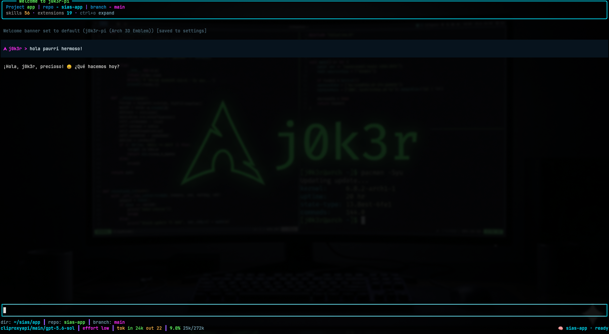
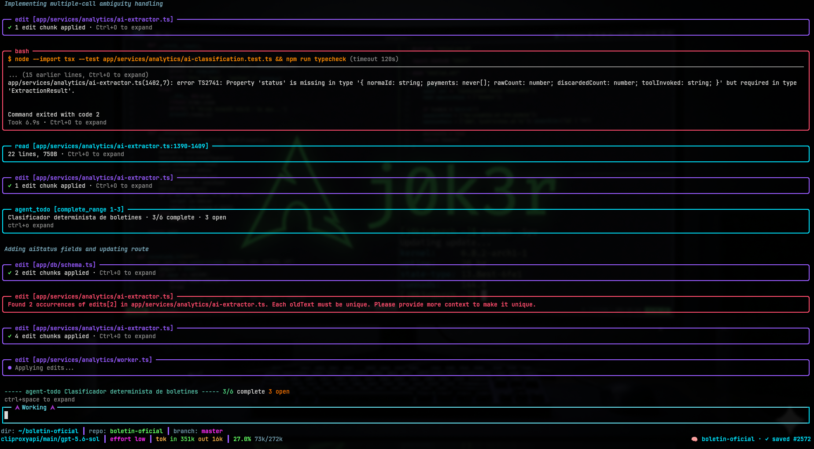
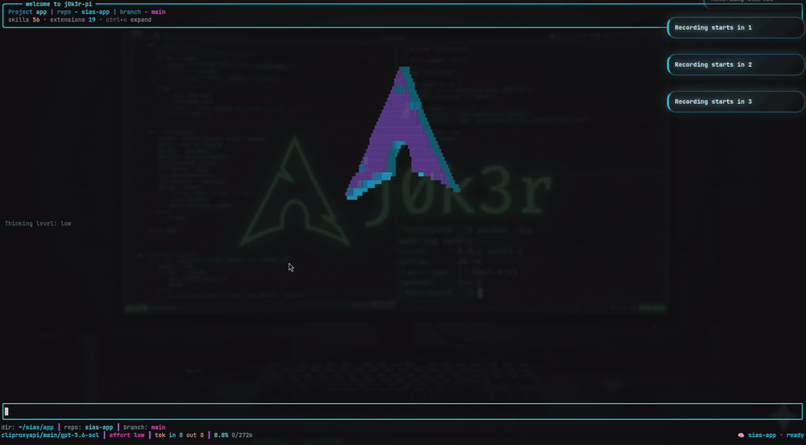
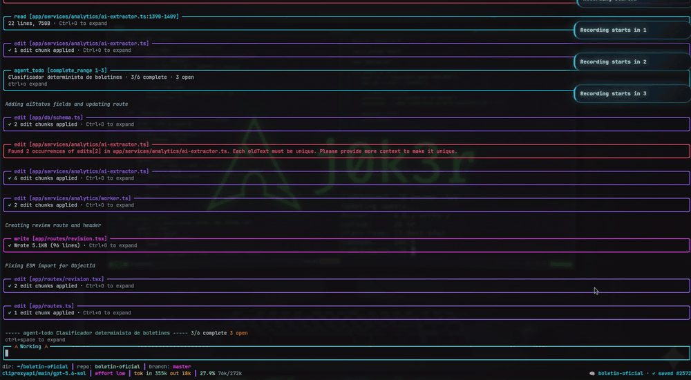

# j0k3r Pi Agent Configuration

[English](#english) | [Español](#español)

## English

Personal/global Pi agent configuration used from `~/.pi/agent`. It contains the agent operating guide, workflow skills, Markdown subagents, permission configuration, local extension copies, and external Pi packages managed by the installer.

### Preview





<details>
<summary><strong>Pi theme and interactive interface</strong></summary>



</details>

<details>
<summary><strong>Agent workflow in action</strong></summary>



</details>

### Layout

| Path | Purpose |
|---|---|
| [`AGENTS.md`](AGENTS.md) | Primary orchestrator instructions, workflow gates, TDD/commit policy, memory behavior, and safety rules. |
| [`skills/`](skills/) | Global/user skills used by the skill registry. Broad domains such as project documentation and Pi configuration are exposed as one router skill with internal reference modules, not many separate `SKILL.md` files. |
| [`subagents/`](subagents/) | Markdown-defined global/user subagents. workflow phase agents live here along with local-only `00-discovery`, durable `deep-researcher`, and news briefing agents. |
| [`extensions/`](extensions/) | Agent-dir extension implementations and their READMEs. In project-local installs these map to `.pi/extensions/*`. |
| [`docs/`](docs/) | Supporting docs for this agent configuration, such as [keyboard shortcuts](docs/keyboard-shortcuts.md). |
| [`subagents.json`](subagents.json) | Global/user subagent configuration and model profile defaults. |
| [`trust.json`](trust.json) / [`auth.json`](auth.json) | Local runtime identity/trust files. They should not be committed with secrets. |
| [`.pi/`](.pi/) | Project-local runtime/config data for this repository, including Skill Registry configuration. |

### Installation and Setup

Prerequisites: the `pi` CLI, Node.js/npm, and Bash.

Clone or place this repository into `~/.pi/agent` (or your target Pi agent directory). Install extension dependencies and external Pi packages:

```bash
cd ~/.pi/agent
for extension_dir in extensions/*; do
  [ -f "$extension_dir/package.json" ] || continue
  (cd "$extension_dir" && npm install)
done
pi install npm:pi-subagents-j0k3r
pi install npm:gentle-engram
```

| Pi package | Purpose |
|---|---|
| [`npm:pi-subagents-j0k3r`](https://www.npmjs.com/package/pi-subagents-j0k3r) | Runtime support for the Markdown-defined subagents in this configuration. |
| [`npm:gentle-engram`](https://www.npmjs.com/package/gentle-engram) | Pi-native persistent memory backed by Engram. |

After installation or update, restart Pi or run `/reload` in an active session.

To update package-managed Pi extensions manually:

```bash
pi update --extensions
```

Package-managed installs or updates without an explicit version follow the package resolver's current release. When dependency drift or runtime supply-chain integrity is material, review the resolved package/version and provenance, and pin an approved version when project policy requires it.

### Core operating model

The agent follows these operating rules. Execution itself is limited to exactly two workflows: **Direct Orchestrator** and **Planned Workflow**.

1. Answer advice-only questions directly without inspecting or changing the project.
2. Route concrete software work through [`workflow-triage`](skills/workflow-triage/SKILL.md): **Direct Orchestrator** or **Planned Workflow**. Explicit no-delegation authorization selects direct execution for the approved scope. Broad work is narrowed or split rather than escalating to another workflow.
3. Use [`deep-researcher`](subagents/deep-researcher.md) for user-requested investigations and deep research reports (local code, docs, web, GitHub, etc.); use local [`00-discovery`](subagents/00-discovery.md) for bounded pre-implementation exploration in Planned Workflow (`openspec/changes/<change-slug>/discovery.md`). Neither is another workflow.
4. Apply [`anti-overengineering`](skills/anti-overengineering/SKILL.md) as a transversal scope/complexity guardrail after the workflow and canonical owner are known. Ordinary local reversible choices remain agent decisions; material product, architecture, migration, dependency, risk, or external-effect choices remain user-owned.
5. Apply strict [`tdd`](skills/tdd/SKILL.md) to code changes: establish a safety baseline, prove the expected **RED**, implement the minimum **GREEN**, then **REFACTOR** while green. Documentation/configuration-only changes use focused structural or syntax validation.
6. Treat policy-sensitive files (`AGENTS.md`, skills, subagents, permissions, memory/context config, workflow extensions) as higher-risk.
7. Never commit, branch, tag, rebase, or push unless the user explicitly asks in the current conversation.
8. Use memory as a curated persistent brain, not as a transcript dump.

Workflow artifacts:

| Workflow | Use | Lifecycle |
|---|---|---|
| Direct Orchestrator | Trivial bounded work, or any approved scope explicitly authorized without delegation | Execute directly with change-type validation and existing authorization limits. |
| Planned Workflow | Bounded work needing one lightweight implementation contract | Optional `discovery.md` → `plan.md` → authorized `apply.md` → independent `verify.md` → authorized archive. |

[`work-workflow`](skills/work-workflow/SKILL.md) governs Planned Workflow gates, handoffs, continuity, verification, and archive. Discovery alone does not authorize implementation or require further phases. Reuse its evidence directly in the same change folder. Historical artifacts remain unchanged; retired workflows are not automatically migrated. Material product questions are resolved with the user and recorded in plan.md; there is no separate PRD review phase.

Delegations use seven compact fields, referencing existing artifacts instead of copying them. Assign the narrowest common parent directory covering the approved work, not an upfront list of files or child directories. Separate additional reading from writing; agents choose necessary files within the goal and exclusions. Exact input/output artifact paths remain mandatory, and actual changed files are recorded afterward for verification.

See [`AGENTS.md`](AGENTS.md) for the full authority, consent, TDD, verification, delivery, and Git policy.

### Project documentation and application evolution

Project documentation is routed through one skill: [`project-documentation`](skills/project-documentation/SKILL.md). The detailed lifecycle owners are internal reference modules under [`skills/project-documentation/references/owners/`](skills/project-documentation/references/owners/), not separate skills loaded by the registry.

```text
project-documentation router
→ one owner module for the first unresolved decision
→ optional Pi execution workflow + Strict TDD
→ validation/change request when evidence changes the product contract
```

Not every increment visits every step. Route only the first unresolved decision and preserve unaffected approved artifacts.

For an existing codebase:

```text
explicit scan approval → reproducible AS_IS snapshot
→ bounded read-only local discovery lanes
→ deterministic evidence consolidation
→ user decisions → canonical TO_BE documents
→ normal delivery and validation loop
```

Owner modules include new-project setup, existing-project onboarding, product discovery/definition, requirements, architecture, technical decisions, delivery planning, and product validation. They share the modular Markdown contract in [`skills/project-documentation/references/document-contract.md`](skills/project-documentation/references/document-contract.md).

Post-MVP change intake reuses approved documentation instead of restarting the lifecycle:

- approved-behavior bug → selected Pi workflow + Strict TDD using existing requirement/acceptance IDs;
- ambiguous bug or clear in-scope feature → requirements owner module first;
- new capability or scope expansion → product-definition owner module;
- uncertain problem/value → product-discovery owner module and, when useful, bounded validation;
- architecture boundary → architecture-definition owner module;
- significant technology/dependency/integration choice → technical-decisions owner module;
- approved change ready for implementation → delivery-planning owner module, then Direct Orchestrator or Planned Workflow.

A completed increment records TDD and acceptance/conformance evidence, broader checks, validation status, learning/change-request links, release authorization, and next-increment eligibility. Documentation defines and traces intended behavior; it never authorizes implementation or release by itself.

Maintainers can use [`docs/pi-workflow-regression-scenarios.md`](docs/pi-workflow-regression-scenarios.md) as non-authoritative review guidance after changing workflow, routing, TDD, documentation, or onboarding contracts.

### Skill registry

[`extensions/skill-registry`](extensions/skill-registry/) generates `.pi/skill-registry.json` and `.pi/skill-registry.md` from both project-local and global/user skills.

This configuration intentionally keeps the registered skill list small. Broad topic families route through one skill and internal modules:

| Router skill | Internal modules |
|---|---|
| [`project-documentation`](skills/project-documentation/SKILL.md) | [`skills/project-documentation/references/owners/`](skills/project-documentation/references/owners/) |
| [`pi-configuration`](skills/pi-configuration/SKILL.md) | [`skills/pi-configuration/references/modules/`](skills/pi-configuration/references/modules/) |

The extension is opt-in at project scope: it only registers when `.pi/skill-registry.config.json` exists with `{"enabled": true}`. Missing or invalid config keeps it disabled. It has no dedicated environment variables; the config file is the project enable gate.

Scanned skill roots:

- `.pi/skills`
- `.agents/skills`
- `~/.pi/agent/skills`
- `~/.agents/skills`

Use the registry as the routing index. Agents should load selected skills from the path reported by the registry rather than assuming a fixed `.pi/skills/...` location.

Useful command/tool:

```text
/skill-registry generate
```

```json
{"write": false}
```

See [`extensions/skill-registry/README.md`](extensions/skill-registry/README.md) for behavior details.

### Extensions

| Extension | README | Purpose |
|---|---|---|
| Agent Todo | [`extensions/agent-todo/README.md`](extensions/agent-todo/README.md) | Single active task checklist for the current conversation branch, plus widget/provider integration. |
| API Tools | [`extensions/api-tools/README.md`](extensions/api-tools/README.md) | Project-local REST and GraphQL tools gated by exact `<ctx.cwd>/.pi/api.json`, with login/access-token persistence, per-request token use, bounded output, and secret-safe diagnostics. |
| Browser Screenshot | [`extensions/browser-screenshot/README.md`](extensions/browser-screenshot/README.md) | Read-only Chrome DevTools Protocol status, tab listing, and screenshots without launching or navigating the browser. |
| Context7 | [`extensions/context7/README.md`](extensions/context7/README.md) | Safe, bounded Context7 library documentation tools without MCP. |
| CLIProxyAPI Usage | [`extensions/cpamc-usage/README.md`](extensions/cpamc-usage/README.md) | CLIProxyAPI quota and subscription usage modal for Pi with provider account breakdown and live quota tracking. |
| Git Diff Panel | [`extensions/git-diff-panel/README.md`](extensions/git-diff-panel/README.md) | Themed split overlay for reviewing Git changes with full Git Worktrees support (`alt+g`). |
| Model Picker | [`extensions/j0k3r-model-picker/README.md`](extensions/j0k3r-model-picker/README.md) | Collapsible floating model selector organized by provider, account/vendor, and model (`/model-select`, `/ms`). |
| PDF Review | [`extensions/pdf-review/README.md`](extensions/pdf-review/README.md) | Local PDF extraction with optional OCR via OCRmyPDF/Tesseract. |
| Skill Registry | [`extensions/skill-registry/README.md`](extensions/skill-registry/README.md) | Routing index generator for global and project skills. Opt-in via `.pi/skill-registry.config.json` with `enabled: true`; no dedicated environment variables. |
| Theme (j0k3r-theme) | [`extensions/j0k3r-theme/README.md`](extensions/j0k3r-theme/README.md) | Interactive TUI theme with 3D animated Arch logo banner, responsive multi-tier footer, custom editor, and `arch-electric` palette. |
| Utils | [`extensions/utils/README.md`](extensions/utils/README.md) | General utility tools, currently Markdown-to-audio conversion using local Piper/eSpeak engines with Piper voice-model, MP3, bitrate, and progress-status support. |
| Websearch | [`extensions/websearch/README.md`](extensions/websearch/README.md) | Bounded web, community, GitHub, and research search with grouped public tool routers. Optional global config: `~/.pi/agent/websearch.json`; credentials are env-only. |
| Workspace Services | [`extensions/workspace-services/README.md`](extensions/workspace-services/README.md) | Management of manually configured workspace services, including lifecycle, status, and bounded local logs. |
| YouTube Research | [`extensions/youtube-research/README.md`](extensions/youtube-research/README.md) | YouTube search, metadata, transcript, channel, and playlist research tools using `yt-dlp`. |

#### Extension quick reference

| Extension | Main tools/capabilities | Short description | More |
|---|---|---|---|
| Agent Todo | `agent_todo` | Maintains one active checklist for the current conversation branch, useful for multi-step implementation or validation work. | [Read more](extensions/agent-todo/README.md) |
| API Tools | Project REST/GraphQL tools | Exposes project-local API calls from `.pi/api.json`, including login/token handling and bounded, secret-safe responses. | [Read more](extensions/api-tools/README.md) |
| Browser Screenshot | `browser_cdp_status`, `browser_tabs_list`, `browser_page_screenshot` | Inspects existing Chrome CDP tabs and captures screenshots without navigation or focus changes. | [Read more](extensions/browser-screenshot/README.md) |
| CLIProxyAPI Usage | `/usage` | Interactive modal displaying real-time CLIProxyAPI quota windows and active accounts by provider. | [Read more](extensions/cpamc-usage/README.md) |
| Context7 | `context7_search_library`, `context7_get_context`, `context7_resolve_and_get_context` | Fetches focused library documentation through Context7 with bounded output and safe configuration. | [Read more](extensions/context7/README.md) |
| Git Diff Panel | `/git-diff [worktree]`, `alt+g` | Themed split overlay for inspecting Git changes and multiple worktree diffs. | [Read more](extensions/git-diff-panel/README.md) |
| Model Picker | `/model-select [ref]`, `/ms` | Collapsible floating model selector organized by provider and account with search and mouse support. | [Read more](extensions/j0k3r-model-picker/README.md) |
| PDF Review | `pdf_extract` | Extracts text and metadata from local PDFs, with optional OCR through OCRmyPDF/Tesseract. | [Read more](extensions/pdf-review/README.md) |
| Skill Registry | `skill_registry_generate`, `skill_registry_resolve` | Builds and queries the routing index for global and project skills. | [Read more](extensions/skill-registry/README.md) |
| Theme (j0k3r-theme) | Custom header, editor, footer, and `arch-electric` theme | Custom interactive TUI components including an animated 3D ASCII Arch banner and responsive footer. | [Read more](extensions/j0k3r-theme/README.md) |
| Utils | `markdown_to_audio` | Converts Markdown into local audio using Piper or eSpeak NG, with MP3 bitrate control and concise progress status. | [Read more](extensions/utils/README.md) |
| Websearch | `web_search`, discussion, research, GitHub helpers | Provides bounded web, community, GitHub, and academic/research search tools. | [Read more](extensions/websearch/README.md) |
| Workspace Services | `workspace_services_*`, `workspace_service_*` | Manages only the services declared in `.pi/workspace-services.json`, with local process state and bounded logs. | [Read more](extensions/workspace-services/README.md) |
| YouTube Research | YouTube search, video, transcript, channel, playlist tools | Searches and inspects YouTube videos, transcripts, channels, and playlists through `yt-dlp`-based tooling. | [Read more](extensions/youtube-research/README.md) |

After changing extension code, markdown subagents, skills, or config during an interactive Pi session, run `/reload` or restart Pi when the relevant README/skill says so.

Note: Skill Registry is disabled until a project explicitly opts in through `.pi/skill-registry.config.json`.

### Validation commands

Run extension validation from each extension directory as needed:

```bash
cd extensions/<extension-name>
npm test
npm run typecheck
```

Examples:

```bash
cd extensions/browser-screenshot
npm test
npm run typecheck
```

```bash
cd extensions/utils
npm test
npm run typecheck
```

```bash
cd extensions/workspace-services
npm test
npm run typecheck
```

Runtime notes:

- YouTube Research requires `yt-dlp` on `PATH` at runtime.
- PDF Review OCR mode requires OCRmyPDF/Tesseract only when OCR is requested.
- Utils Markdown-to-audio requires a local TTS engine: `piper-tts`/`piper` with at least one Piper `.onnx` voice model, or `espeak-ng` fallback. `ffmpeg` is required only for MP3 output.

### Security notes

- Do not store secrets in skills, README files, memories, `.pi/*.json`, or extension config.
- Live Context7 calls require `CONTEXT7_API_KEY` in the Pi process environment, not in repository files.
- Skill Registry has no dedicated environment variables; project opt-in is controlled by `.pi/skill-registry.config.json` with `enabled: true`.
- Websearch credentials such as `EXA_API_KEY`, `PARALLEL_API_KEY`, `GITHUB_TOKEN`, `STACK_EXCHANGE_KEY`, `OPENALEX_MAILTO`, `CROSSREF_MAILTO`, and `SEMANTIC_SCHOLAR_API_KEY` belong in the process environment, not repository files.
- `Allowed Bash` currently requires explicit patterns for Python-related risky commands; full Bash deny-by-default allowlisting is a known pending hardening item.

### Subagents

The Subagents extension is maintained as the independent [`pi-subagents-j0k3r`](https://github.com/j0k3r-dev-rgl/pi-subagents-j0k3r) package. The installer installs or refreshes that package, while this repository keeps the global/user Markdown subagent definitions and related configuration.

Current global/user subagents are under [`subagents/*.md`](subagents/):

- [`00-discovery`](subagents/00-discovery.md) — local investigation; its assigned `discovery.md` is the sole write exception. No internet.
- [`deep-researcher`](subagents/deep-researcher.md) — internet-capable deep research that writes `report.md` and `sources.md` in an assigned directory.
- [`01-planning`](subagents/01-planning.md) — creates the bounded Planned Workflow implementation contract.
- [`news-researcher`](subagents/news-researcher.md) — tech news intelligence gathering and briefing report generation.
- [`02-apply`](subagents/02-apply.md) — approved implementation.
- [`03-verify`](subagents/03-verify.md) — independent verification without fixing.
- [`tool-smoke`](subagents/tool-smoke.md) — smoke testing tool execution and environment verification.

The main agent remains the orchestrator. Subagents must not delegate to other subagents. After passing verification and explicit user archive approval, the orchestrator moves the complete change folder directly, checking continuity and destination safety; there is no archive subagent.

### Documentation maintenance

Extension READMEs should describe the implementation in this checkout using repo-relative paths like `extensions/<name>`. When useful, also mention the project-local equivalent `.pi/extensions/<name>`. Keep related-doc links limited to files that exist in this repository unless intentionally referencing external Pi docs.

---

## Español

Configuración global/personal de Pi usada desde `~/.pi/agent`. Contiene la guía operativa del agente, skills de workflow, subagentes Markdown, configuración de permisos, copias locales de extensiones y paquetes externos de Pi gestionados por el instalador.

### Vista previa


<details>
<summary><strong>Tema e interfaz interactiva de Pi</strong></summary>


</details>

<details>
<summary><strong>Workflow del agente en acción</strong></summary>


</details>

### Estructura

| Ruta | Propósito |
|---|---|
| [`AGENTS.md`](AGENTS.md) | Instrucciones principales del orquestador, gates de workflow, política de TDD/commits, memoria y seguridad. |
| [`skills/`](skills/) | Skills globales/de usuario usadas por el Skill Registry. Dominios amplios como documentación de proyecto y configuración de Pi se exponen como una skill router con módulos internos de referencia, no como muchos `SKILL.md` separados. |
| [`subagents/`](subagents/) | Subagentes globales/de usuario definidos en Markdown. Aquí viven los agentes de fases workflow junto con `00-discovery` local-only, `deep-researcher` durable y agentes de briefing. |
| [`extensions/`](extensions/) | Implementaciones de extensiones del directorio de agente y sus READMEs. En instalaciones por proyecto equivalen a `.pi/extensions/*`. |
| [`docs/`](docs/) | Documentos de apoyo para esta configuración, como [atajos de teclado](docs/keyboard-shortcuts.md). |
| [`subagents.json`](subagents.json) | Configuración global/de usuario para subagentes y perfiles de modelo. |
| [`trust.json`](trust.json) / [`auth.json`](auth.json) | Archivos locales runtime de identidad/confianza. No deben commitearse con secretos. |
| [`.pi/`](.pi/) | Datos runtime/config locales de este repositorio, incluyendo configuración de Skill Registry. |

### Instalación y configuración

Requisitos: CLI `pi`, Node.js/npm y Bash.

Clona o ubica este repositorio en `~/.pi/agent` (o tu directorio de agente Pi de destino). Instala las dependencias de las extensiones locales y los paquetes externos de Pi:

```bash
cd ~/.pi/agent
for extension_dir in extensions/*; do
  [ -f "$extension_dir/package.json" ] || continue
  (cd "$extension_dir" && npm install)
done
pi install npm:pi-subagents-j0k3r
pi install npm:gentle-engram
```

| Paquete Pi | Propósito |
|---|---|
| [`npm:pi-subagents-j0k3r`](https://www.npmjs.com/package/pi-subagents-j0k3r) | Soporte runtime para los subagentes definidos en Markdown de esta configuración. |
| [`npm:gentle-engram`](https://www.npmjs.com/package/gentle-engram) | Memoria persistente nativa de Pi respaldada por Engram. |

Después de instalar o actualizar, reinicia Pi o ejecuta `/reload` en una sesión activa.

Para actualizar manualmente solo las extensiones gestionadas como paquetes de Pi:

```bash
pi update --extensions
```

Las instalaciones o actualizaciones de paquetes sin versión explícita siguen la release vigente que resuelva el gestor. Cuando el drift de dependencias o la integridad de supply chain del runtime sea material, revisa el paquete/versión y su provenance, y fija una versión aprobada cuando lo exija la política del proyecto.

### Modelo operativo principal

El agente sigue estas reglas operativas. La ejecución está limitada exactamente a dos workflows: **Direct Orchestrator** y **Planned Workflow**.

1. Responder consultas de asesoramiento sin inspeccionar ni modificar el proyecto.
2. Enrutar trabajo concreto mediante [`workflow-triage`](skills/workflow-triage/SKILL.md): **Direct Orchestrator** o **Planned Workflow**. La autorización explícita de trabajar sin delegación selecciona ejecución directa para ese alcance. El trabajo excesivo se acota o divide, sin activar otro workflow.
3. Usar [`deep-researcher`](subagents/deep-researcher.md) para investigaciones solicitadas por el usuario y reportes de investigación profunda (código local, documentación, web, GitHub, etc.); usar [`00-discovery`](subagents/00-discovery.md) local para exploración previa a la implementación en Planned Workflow (`openspec/changes/<change-slug>/discovery.md`). Ninguno es otro workflow.
4. Aplicar [`anti-overengineering`](skills/anti-overengineering/SKILL.md) como guardrail transversal después de conocer workflow y owner. Los detalles locales, reversibles y ordinarios pertenecen al agente; producto, arquitectura, migraciones, dependencias, riesgo y efectos externos materiales pertenecen al usuario.
5. Aplicar [`tdd`](skills/tdd/SKILL.md) estricto a cambios de código: baseline de seguridad, **RED** esperado, mínimo **GREEN** y **REFACTOR** manteniendo verde. Los cambios solo de documentación/configuración usan validación estructural o sintáctica enfocada.
6. Tratar archivos sensibles de política (`AGENTS.md`, skills, subagentes, permisos, configuración de memoria/contexto y extensiones de workflow) como superficies de mayor riesgo.
7. Nunca hacer commits, branches, tags, rebases o pushes salvo pedido explícito del usuario en la conversación actual.
8. Usar la memoria como cerebro persistente curado, no como volcado de transcript.

Artefactos de workflow:

| Workflow | Uso | Ciclo |
|---|---|---|
| Direct Orchestrator | Trabajo trivial acotado o alcance aprobado explícitamente sin delegación | Ejecución directa con validación según el cambio y límites de autorización. |
| Planned Workflow | Trabajo acotado que necesita un único contrato ligero | `discovery.md` opcional → `plan.md` → `apply.md` autorizado → `verify.md` independiente → archivo autorizado. |

[`work-workflow`](skills/work-workflow/SKILL.md) gobierna gates, handoffs, continuidad, verificación y archivo de Planned Workflow. Discovery por sí solo no autoriza implementación ni obliga a seguir fases. Su evidencia se reutiliza directamente en la misma carpeta del cambio. Los artefactos históricos se conservan sin migración automática. Las dudas materiales de producto se resuelven con el usuario y se registran en plan.md; no hay una fase separada de revisión de PRD.

Las delegaciones usan siete campos compactos y referencian los artefactos existentes sin copiarlos. Se asigna el directorio padre común más acotado, no una lista anticipada de archivos o subdirectorios. La lectura adicional se separa de la escritura; el agente elige los archivos necesarios dentro del objetivo y las exclusiones. Se mantienen rutas exactas de entrada/salida de artefactos y se registran después los archivos realmente modificados para verificar.

Ver [`AGENTS.md`](AGENTS.md) para la política completa de autoridad, consentimiento, TDD, verificación, entrega y Git.

### Documentación de proyecto y evolución de la aplicación

La documentación de proyecto se enruta mediante una sola skill: [`project-documentation`](skills/project-documentation/SKILL.md). Los owners detallados del lifecycle son módulos internos bajo [`skills/project-documentation/references/owners/`](skills/project-documentation/references/owners/), no skills separadas cargadas por el registry.

```text
router project-documentation
→ un módulo owner para la primera decisión sin resolver
→ workflow Pi opcional + Strict TDD
→ validación/change request cuando la evidencia cambia el contrato de producto
```

No todos los incrementos recorren cada paso. Se enruta solo la primera decisión sin resolver y se preservan los artefactos aprobados no afectados.

Para un proyecto existente:

```text
autorización explícita de escaneo → snapshot AS_IS reproducible
→ lanes locales read-only acotados
→ consolidación determinista de evidencia
→ decisiones del usuario → documentos TO_BE canónicos
→ ciclo normal de delivery y validation
```

Los módulos owner incluyen setup de proyecto nuevo, onboarding de proyecto existente, discovery/definition de producto, requisitos, arquitectura, decisiones técnicas, planificación de entrega y validación de producto. Comparten el contrato Markdown modular en [`skills/project-documentation/references/document-contract.md`](skills/project-documentation/references/document-contract.md).

Después del MVP se reutiliza la documentación aprobada en vez de reiniciar el ciclo:

- bug con comportamiento aprobado → workflow Pi seleccionado + Strict TDD usando IDs de requirement/acceptance existentes;
- bug ambiguo o feature clara dentro del scope → primero el módulo de requisitos;
- nueva capability o ampliación de scope → módulo de product-definition;
- problema/valor incierto → módulo de product-discovery y, cuando aporte valor, validación acotada;
- cambio de límites arquitectónicos → módulo de architecture-definition;
- decisión significativa de tecnología/dependencia/integración → módulo de technical-decisions;
- cambio aprobado listo para implementar → módulo de delivery-planning y después Direct Orchestrator o Planned Workflow.

Un incremento completo registra evidencia TDD y de aceptación/conformidad, checks adicionales, estado de Validation, enlaces de aprendizaje/change request, autorización de release y elegibilidad del siguiente incremento. La documentación define y traza el comportamiento previsto; nunca autoriza por sí sola implementación ni release.

Los mantenedores pueden usar [`docs/pi-workflow-regression-scenarios.md`](docs/pi-workflow-regression-scenarios.md) como guía no autoritativa después de cambiar contratos de workflow, routing, TDD, documentación u onboarding.

### Skill Registry

[`extensions/skill-registry`](extensions/skill-registry/) genera `.pi/skill-registry.json` y `.pi/skill-registry.md` desde skills locales de proyecto y skills globales/de usuario.

Esta configuración mantiene intencionalmente chica la lista de skills registradas. Las familias amplias enrutan mediante una skill y módulos internos:

| Skill router | Módulos internos |
|---|---|
| [`project-documentation`](skills/project-documentation/SKILL.md) | [`skills/project-documentation/references/owners/`](skills/project-documentation/references/owners/) |
| [`pi-configuration`](skills/pi-configuration/SKILL.md) | [`skills/pi-configuration/references/modules/`](skills/pi-configuration/references/modules/) |

La extensión es opt-in por proyecto: solo se registra cuando existe `.pi/skill-registry.config.json` con `{"enabled": true}`. Si falta o es inválido, permanece deshabilitada. No tiene variables de entorno dedicadas; el archivo de configuración es la compuerta de activación.

Raíces de skills escaneadas:

- `.pi/skills`
- `.agents/skills`
- `~/.pi/agent/skills`
- `~/.agents/skills`

Usa el registry como índice de routing. Los agentes deben cargar las skills desde la ruta reportada por el registry, no asumir una ubicación fija como `.pi/skills/...`.

Comando/tool útil:

```text
/skill-registry generate
```

```json
{"write": false}
```

Ver [`extensions/skill-registry/README.md`](extensions/skill-registry/README.md) para detalles de comportamiento.

### Extensiones

| Extensión | README | Propósito |
|---|---|---|
| Agent Todo | [`extensions/agent-todo/README.md`](extensions/agent-todo/README.md) | Checklist de una sola tarea activa para la rama de conversación actual, más integración de widget/provider. |
| API Tools | [`extensions/api-tools/README.md`](extensions/api-tools/README.md) | Herramientas REST y GraphQL por proyecto, activadas por `<ctx.cwd>/.pi/api.json`, con login/token, uso de token por request, salida acotada y diagnósticos seguros. |
| Browser Screenshot | [`extensions/browser-screenshot/README.md`](extensions/browser-screenshot/README.md) | Estado, listado de pestañas y capturas de Chrome DevTools Protocol en modo de solo lectura, sin iniciar ni navegar el navegador. |
| Context7 | [`extensions/context7/README.md`](extensions/context7/README.md) | Herramientas seguras y acotadas para documentación de librerías con Context7, sin MCP. |
| CLIProxyAPI Usage | [`extensions/cpamc-usage/README.md`](extensions/cpamc-usage/README.md) | Modal de cuotas y uso de suscripciones en CLIProxyAPI para Pi, con detalle por cuenta de proveedor y seguimiento en tiempo real. |
| Git Diff Panel | [`extensions/git-diff-panel/README.md`](extensions/git-diff-panel/README.md) | Panel dividido con tema visual para revisar cambios en Git con soporte completo de Git Worktrees (`alt+g`). |
| Model Picker | [`extensions/j0k3r-model-picker/README.md`](extensions/j0k3r-model-picker/README.md) | Selector flotante y colapsable de modelos organizado por proveedor, cuenta/fabricante y modelo (`/model-select`, `/ms`). |
| PDF Review | [`extensions/pdf-review/README.md`](extensions/pdf-review/README.md) | Extracción local de PDF con OCR opcional vía OCRmyPDF/Tesseract. |
| Skill Registry | [`extensions/skill-registry/README.md`](extensions/skill-registry/README.md) | Generador de índice de routing para skills globales y de proyecto. Opt-in vía `.pi/skill-registry.config.json` con `enabled: true`; sin variables de entorno dedicadas. |
| Tema (j0k3r-theme) | [`extensions/j0k3r-theme/README.md`](extensions/j0k3r-theme/README.md) | Tema TUI interactivo con banner 3D animado de Arch Linux, pie adaptativo multiescala, editor personalizado y paleta `arch-electric`. |
| Utils | [`extensions/utils/README.md`](extensions/utils/README.md) | Utilidades generales; actualmente conversión de Markdown a audio con Piper/eSpeak local, voces Piper, MP3, bitrate y progreso en status bar. |
| Websearch | [`extensions/websearch/README.md`](extensions/websearch/README.md) | Búsqueda web, comunidades, GitHub e investigación con salida acotada y routers públicos agrupados. Config opcional global: `~/.pi/agent/websearch.json`; credenciales solo por entorno. |
| Workspace Services | [`extensions/workspace-services/README.md`](extensions/workspace-services/README.md) | Gestión de servicios de workspace configurados manualmente, incluyendo ciclo de vida, estado y logs locales acotados. |
| YouTube Research | [`extensions/youtube-research/README.md`](extensions/youtube-research/README.md) | Búsqueda de YouTube, metadata, transcripciones, canales y playlists usando `yt-dlp`. |

#### Referencia rápida de extensiones

| Extensión | Herramientas/capacidades principales | Descripción breve | Más información |
|---|---|---|---|
| Agent Todo | `agent_todo` | Mantiene una checklist activa para la rama de conversación actual; útil en trabajos de implementación o validación con varios pasos. | [Ver más](extensions/agent-todo/README.md) |
| API Tools | Herramientas REST/GraphQL del proyecto | Expone llamadas API locales definidas en `.pi/api.json`, con login/token, respuestas acotadas y diagnósticos seguros. | [Ver más](extensions/api-tools/README.md) |
| Browser Screenshot | `browser_cdp_status`, `browser_tabs_list`, `browser_page_screenshot` | Inspecciona pestañas Chrome CDP existentes y obtiene capturas sin navegar ni cambiar el foco. | [Ver más](extensions/browser-screenshot/README.md) |
| CLIProxyAPI Usage | `/usage` | Modal interactivo que muestra ventanas de cuota en tiempo real y cuentas activas por proveedor en CLIProxyAPI. | [Ver más](extensions/cpamc-usage/README.md) |
| Context7 | `context7_search_library`, `context7_get_context`, `context7_resolve_and_get_context` | Obtiene documentación enfocada de librerías con Context7, salida acotada y configuración segura. | [Ver más](extensions/context7/README.md) |
| Git Diff Panel | `/git-diff [worktree]`, `alt+g` | Panel dividido temático para inspeccionar cambios de Git y diffs entre múltiples worktrees. | [Ver más](extensions/git-diff-panel/README.md) |
| Model Picker | `/model-select [ref]`, `/ms` | Selector jerárquico de modelos organizado por proveedor y cuenta, con filtrado y soporte de mouse. | [Ver más](extensions/j0k3r-model-picker/README.md) |
| PDF Review | `pdf_extract` | Extrae texto y metadata de PDFs locales, con OCR opcional mediante OCRmyPDF/Tesseract. | [Ver más](extensions/pdf-review/README.md) |
| Skill Registry | `skill_registry_generate`, `skill_registry_resolve` | Construye y consulta el índice de routing para skills globales y de proyecto. | [Ver más](extensions/skill-registry/README.md) |
| Tema (j0k3r-theme) | Cabecera, editor, pie personalizados y tema `arch-electric` | Componentes TUI interactivos que incluyen banner 3D en ASCII de Arch animado y pie responsivo. | [Ver más](extensions/j0k3r-theme/README.md) |
| Utils | `markdown_to_audio` | Convierte Markdown a audio local con Piper o eSpeak NG, control de bitrate MP3 y progreso compacto en status bar. | [Ver más](extensions/utils/README.md) |
| Websearch | `web_search`, herramientas de discusión, investigación y GitHub | Provee búsquedas acotadas en web, comunidades, GitHub y fuentes académicas/de investigación. | [Ver más](extensions/websearch/README.md) |
| Workspace Services | `workspace_services_*`, `workspace_service_*` | Gestiona solo los servicios declarados en `.pi/workspace-services.json`, con estado local de procesos y logs acotados. | [Ver más](extensions/workspace-services/README.md) |
| YouTube Research | Herramientas de búsqueda, video, transcripción, canal y playlist | Busca e inspecciona videos, transcripciones, canales y playlists de YouTube mediante herramientas basadas en `yt-dlp`. | [Ver más](extensions/youtube-research/README.md) |

Después de cambiar código de extensiones, subagentes Markdown, skills o configuración durante una sesión interactiva de Pi, ejecuta `/reload` o reinicia Pi cuando el README/skill correspondiente lo indique.

Nota: Skill Registry permanece deshabilitado hasta que un proyecto lo active explícitamente mediante `.pi/skill-registry.config.json`.

### Comandos de validación

Ejecuta la validación de cada extensión desde su directorio según sea necesario:

```bash
cd extensions/<nombre-de-extensión>
npm test
npm run typecheck
```

Ejemplos:

```bash
cd extensions/browser-screenshot
npm test
npm run typecheck
```

```bash
cd extensions/utils
npm test
npm run typecheck
```

```bash
cd extensions/workspace-services
npm test
npm run typecheck
```

Notas runtime:

- YouTube Research requiere `yt-dlp` en `PATH`.
- PDF Review en modo OCR requiere OCRmyPDF/Tesseract solo cuando se solicita OCR.
- Utils Markdown-to-audio requiere un motor TTS local: `piper-tts`/`piper` con al menos una voz Piper `.onnx`, o fallback `espeak-ng`. `ffmpeg` solo es necesario para salida MP3.

### Notas de seguridad

- No guardes secretos en skills, README, memorias, `.pi/*.json` o configuración de extensiones.
- Las llamadas live de Context7 requieren `CONTEXT7_API_KEY` en el entorno del proceso Pi, no en archivos del repositorio.
- Skill Registry no tiene variables de entorno dedicadas; el opt-in por proyecto se controla con `.pi/skill-registry.config.json` y `enabled: true`.
- Credenciales de Websearch como `EXA_API_KEY`, `PARALLEL_API_KEY`, `GITHUB_TOKEN`, `STACK_EXCHANGE_KEY`, `OPENALEX_MAILTO`, `CROSSREF_MAILTO` y `SEMANTIC_SCHOLAR_API_KEY` deben vivir en el entorno del proceso, no en archivos del repositorio.
- `Allowed Bash` hoy exige patrones explícitos para comandos Python riesgosos; la allowlist deny-by-default para todo Bash queda como hardening pendiente conocido.

### Subagentes

La extensión Subagents se mantiene como el paquete independiente [`pi-subagents-j0k3r`](https://github.com/j0k3r-dev-rgl/pi-subagents-j0k3r). El instalador instala o actualiza ese paquete, mientras este repositorio conserva las definiciones Markdown globales/de usuario y la configuración relacionada.

Los subagentes globales/de usuario actuales están en [`subagents/*.md`](subagents/):

- [`00-discovery`](subagents/00-discovery.md) — investigación local; el `discovery.md` asignado es su única excepción de escritura. Sin internet.
- [`deep-researcher`](subagents/deep-researcher.md) — investigación profunda con internet que escribe `report.md` y `sources.md` en un directorio asignado.
- [`01-planning`](subagents/01-planning.md) — crea el contrato Planned Workflow para cambios acotados.
- [`news-researcher`](subagents/news-researcher.md) — investigación de noticias tecnológicas y generación de reportes de briefing.
- [`02-apply`](subagents/02-apply.md) — implementación autorizada.
- [`03-verify`](subagents/03-verify.md) — verificación independiente sin arreglar.
- [`tool-smoke`](subagents/tool-smoke.md) — pruebas de humo para validación del entorno y ejecución de herramientas.

El agente principal sigue siendo el orquestador. Los subagentes no deben delegar a otros subagentes. Tras verificación aprobada y autorización explícita del usuario para archivar, el orquestador mueve directamente la carpeta completa, comprobando continuidad y seguridad del destino; no hay subagente de archivo.

### Mantenimiento de documentación

Los READMEs de extensiones deben describir la implementación de este checkout usando rutas relativas al repo como `extensions/<name>`. Cuando sea útil, también pueden mencionar el equivalente local por proyecto `.pi/extensions/<name>`. Mantén links a documentos relacionados limitados a archivos que existen en este repositorio, salvo referencias intencionales a documentación externa de Pi.
