# Informe Arquitectónico: Flujo de Trabajo Agéntico y la Integración de Jev (System One)

Este informe presenta de forma conceptual y teórica cómo opera el sistema de agentes autónomos, cómo se comporta **sin** Jev, y cuál es el modelo ideal de toma de decisiones e inferencia al incorporar **Jev (System One)** en el ciclo de vida de desarrollo.

---

## 1. El Paradigma Actual: Sistema sin Jev (Monolito Generativo)

### Cómo funciona actualmente
En un flujo agéntico estándar basado exclusivamente en Grandes Modelos de Lenguaje (LLMs conversacionales / Sistema 2), un único motor generativo se encarga de absolutamente todo:
1. Recibir la solicitud del usuario.
2. Razonar y seleccionar el camino a seguir (triage/enrutamiento).
3. Evaluar si la tarea tiene ambigüedades o si faltan decisiones.
4. Diseñar la solución técnica (planificación).
5. Evaluar si la propuesta está sobrecargada o respeta principios de simplicidad (KISS/YAGNI).
6. Ejecutar las herramientas y redactar código.
7. Verificar que el resultado sea correcto.

```mermaid
flowchart TD
    User([Usuario / Solicitud]) --> LLM_Orch[LLM Orquestador]
    
    subgraph S2_Only ["Ciclo Exclusivo Sistema 2 (Autorregresivo y Lento)"]
        LLM_Orch -->|Auto-reflexión en texto| Triage{"¿Ruta Directa o Planificada?"}
        Triage -->|Generación de tokens sintácticos| SubLLM["Subagentes Generativos"]
        
        SubLLM --> Plan["Planificación (Texto)"]
        Plan -->|Auto-evaluación subjetiva| DriftCheck{"¿Hay sobreingeniería?"}
        DriftCheck -->|Riesgo de sesgo/sycophancy| Code["Generación de Código"]
        Code --> Verify["Verificación Cualitativa"]
    end

    Verify --> Result([Resultado Final])

    style S2_Only fill:#2b1d1d,stroke:#ff6b6b,stroke-width:2px
```

### Límites y problemas teóricos del modelo sin Jev
* **Sesgo de complacencia (*Sycophancy*):** El mismo LLM que propone una solución compleja tiende a validarse a sí mismo como "correcto", justificando capas innecesarias o asumiendo decisiones que deberían ser del usuario.
* **Sobrecarga de latencia:** Para responder a una pregunta binaria (ej. "¿Falta información?") el LLM debe generar explicaciones de cientos de tokens en un bucle autorregresivo secuencial de varios segundos.
* **Fragilidad sintáctica:** La extracción de decisiones depende de parsear bloques de texto o JSON condicionado (*logit masking*), lo que distorsiona la distribución semántica del modelo.
* **Costo asimétrico:** El ciclo continuo de auto-reflexión multiplica innecesariamente el consumo de tokens de salida.

---

## 2. El Paradigma Ideal: Dualidad Cognitiva (Sistema 1 + Sistema 2)

La integración de **Jev** introduce una división del trabajo basada en la **teoría de doble proceso cognitivo**:
* **Sistema 2 (El Ejecutor / Constructor - LLM):** Excelente para síntesis amplia, exploración abierta, escritura de código complejo y orquestación contextual profunda.
* **Sistema 1 (El Juez Calibrado / Árbitro - Jev):** Inferencia inmediata en un solo pase hacia adelante (*single forward pass*), sin generación de texto, emitiendo probabilidades continuas (`Noul`), clasificaciones categóricas (`Choice`) y puntuaciones graduadas (`Score`).

```mermaid
flowchart TD
    User([Petición del Usuario]) --> Orch[Orquestador LLM - Sistema 2]

    %% Triage Lane
    Orch -.->|Consulta de Triage en la Sombra| JevTriage["Jev: Enrutamiento Paralelo"]
    Orch --> CanonicalRoute["Ruta Oficial Elegida"]
    
    CanonicalRoute & JevTriage --> GateDiscrepancy{"¿Acuerdo entre LLM y Jev?"}
    
    GateDiscrepancy -->|No / Discrepancia| CB_User["CIRCUIT BREAKER: El Usuario Decide"]
    CB_User --> UserDecision([Decisión Humana])
    UserDecision --> Flow[Fase de Trabajo]
    
    GateDiscrepancy -->|Sí / Consenso| Flow

    %% Subagent Phase
    subgraph ExecutionLifecycle ["Ciclo de Ejecución con Sensores Jev"]
        Flow --> GateIn{"Sensor de Ambigüedad (Circuit Breaker)"}
        GateIn -.->|Evalúa estado inicial| JevCB["Jev: ¿Faltan decisiones críticas?"]
        
        JevCB -->|Probabilidad Alta| CB_Stop["Freno Inmediato -> Consultar Usuario"]
        JevCB -->|Despejado| Planning["Elaboración de Plan / Propuesta"]
        
        Planning --> GateOver{"Sensor de Simplicidad (Anti-Overengineering)"}
        GateOver -.->|Evalúa propuesta| JevOver["Jev: ¿Viola KISS/YAGNI?"]
        
        JevOver -->|Sobreingeniería detectada| Simplify["Podar Abstracciones Especulativas"]
        Simplify --> CodeGen["Implementación de Código"]
        JevOver -->|Aprobado| CodeGen
        
        CodeGen --> DeterministicTests["Pruebas Deterministas (Compilador/Tests)"]
        DeterministicTests --> GateQual{"Sensor de Calidad Cualitativa"}
        GateQual -.->|Evalúa criterios no computables| JevVerify["Jev: Verificación Cualitativa"]
    end

    JevVerify --> Complete([Entrega Validada])

    style ExecutionLifecycle fill:#1a2332,stroke:#4dabf7,stroke-width:2px
```

---

## 3. Comparativa Teórica: Antes vs. Después

| Dimensión | Sin Jev (Monolito Generativo) | Con Jev (Dualidad Sistema 1 + Sistema 2) |
|---|---|---|
| **Mecánica de Decisión** | Generación secuencial token a token con justificación en prosa. | Proyección matricial directa a cabezas de decisión tipadas. |
| **Latencia de Control** | 2.000 ms – 5.000 ms por cada puerta de reflexión. | 70 ms – 300 ms por sensor. |
| **Gobernanza de Ambigüedad** | El LLM asume supuestos por defecto y avanza sin consultar. | El sensor detecta decisiones faltantes y activa el *Circuit Breaker*. |
| **Control de Complejidad** | Tendencia natural a la sobreingeniería y abstracciones prematuras. | Auditoría matemática independiente basada en probabilidad de KISS/YAGNI. |
| **Resolución de Conflictos** | La IA decide siempre de forma autónoma y opaca. | Discrepancias entre orquestador y juez activan el arbitraje del usuario. |
| **Verificación** | Binaria: o pasa tests o el LLM alucina sobre el cumplimiento. | Híbrida: pruebas unitarias deterministas + juicio cualitativo tipado. |

---

## 4. Los Tres Pilares Conceptuales de la Integración

### A. Sensores de Fase en lugar de Intervención en Bucle Interno
Jev **no** actúa como un linter que interrumpe cada edición de archivo. Se ubica teóricamente en las **fronteras de fase**:
1. **Entrada de Fase (Circuit Breaker):** Garantiza que la tarea esté suficientemente definida antes de comenzar a gastar recursos.
2. **Salida de Planificación (Anti-Overengineering):** Actúa como filtro de sobrediseño antes de autorizar la escritura de código.
3. **Salida de Verificación (Acceptance Score):** Califica aspectos cualitativos (claridad de mensajes, legibilidad de contratos) que un test unitario no puede medir.

### B. El Principio de Determinismo Estricto
Jev nunca reemplaza lo que el software ya puede verificar de manera exacta:
* Si un código no compila, falla un test o no existe un archivo, manda la herramienta determinista.
* Jev solo interviene donde se requiere **juicio semántico y probabilístico**, liberando al LLM principal de deliberaciones triviales.

### C. Triaje en la Sombra con Arbitraje Humano
El orquestador principal retiene la autoridad de elegir la estrategia de trabajo. Jev corre en paralelo evaluando la misma petición:
* Si ambos coinciden, el flujo avanza con máxima fluidez.
* Si discrepan, el sistema **no intenta resolver el conflicto internamente**. Se detiene y expone ambas posturas al usuario, garantizando que el control arquitectónico permanezca siempre en manos humanas.
